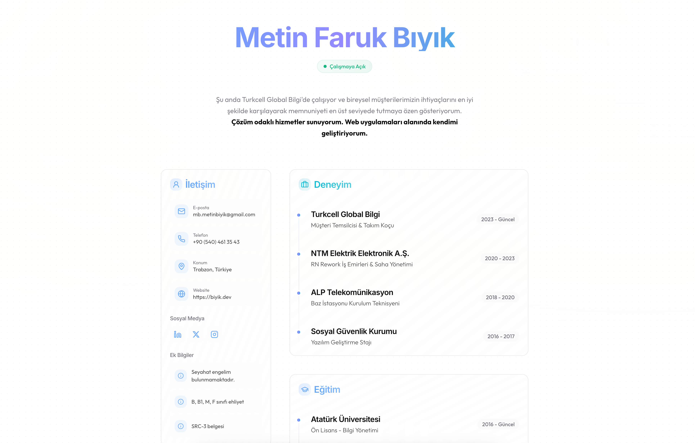

# metinfarukbiyik

# 🌟 Kişisel CV Web Sitesi

  

# Metin Faruk Bıyık - Geliştirici

### 🌐 Sosyal Medya & İletişim

### 🇹🇷 Hakkımda

Web teknolojileri ve modern uygulama geliştirme alanında kendini sürekli geliştiren, öğrenmeye ve paylaşmaya tutkulu bir geliştirici.

### 🇬🇧 About Me

A passionate developer who continuously improves himself in web technologies and modern application development, dedicated to learning and sharing knowledge. # metinfarukbiyik

## 📄 Lisans

Bu proje MIT lisansı altında lisanslanmıştır. Detaylar için [LICENSE](LICENSE) dosyasına bakabilirsiniz.

## 👨‍💻 Geliştirici

Metin Faruk Bıyık tarafından ❤️ ile geliştirilmiştir.

